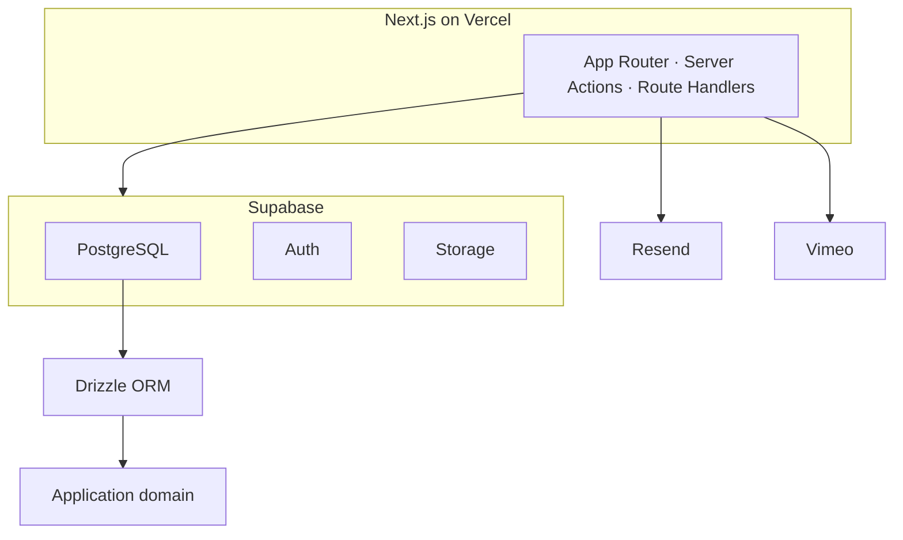
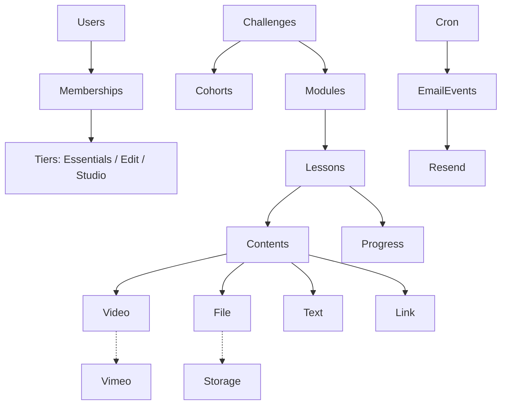
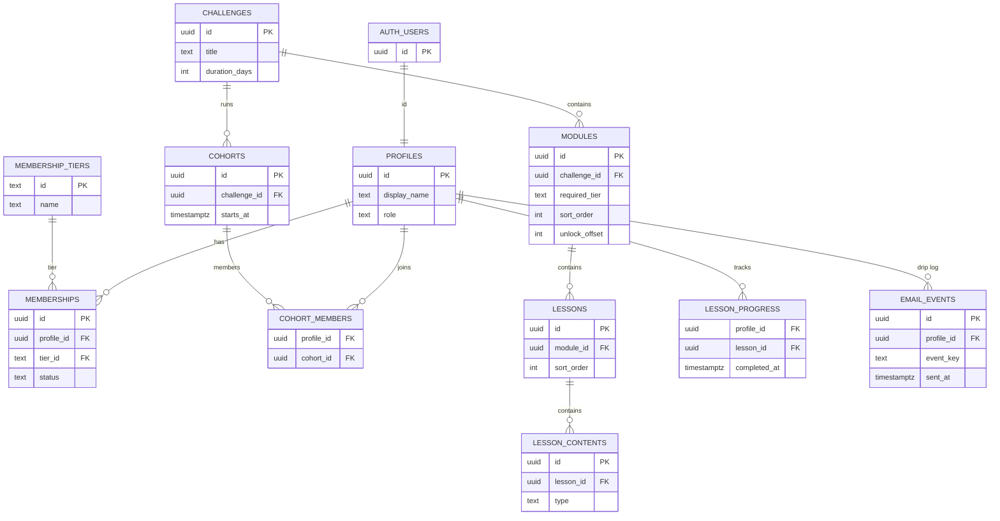

# Architecture

Target stack: **Next.js + Supabase + Drizzle + Resend + Vimeo**, hosted on **Vercel**.

Visual maps (generated from the project sketches):

- [System architecture](./diagrams/agent-labs-system-architecture.png)
- [Data model](./diagrams/agent-labs-data-model.png)

## System



| Service | Role | When |
| --- | --- | --- |
| Next.js (Vercel) | UI, server actions, cron, authorization | Now |
| Supabase Auth | Login, sessions, `auth.users` | Now |
| Supabase Postgres + Drizzle | Source of truth for profiles, content, progress | Now |
| Supabase Storage | Lesson files (PDFs, downloads) | Structure now; uploads when needed |
| Resend | Drip / unlock emails, driven by cron + `email_events` | After content skeleton exists |
| Vimeo | Lesson video host | **Not v1** — wire after AJ feedback |

Next.js talks to Supabase/Resend/Vimeo. **Drizzle** is the only way application code queries Postgres. Keep business rules (gating, drip, progress) out of UI components.

## Application domain



- A **challenge** is the 40-day program definition.
- A **cohort** is a dated run of that challenge. Students join cohorts, not the challenge directly.
- **Modules → lessons → lesson_contents** is the catalog. Content types: `video` (Vimeo, later), `file` (Storage), `text`, `link`.
- **Membership tier** decides which catalog the student sees.
- **Progress** is per user per lesson.
- **Cron + email_events + Resend** is the drip sequence. Unlock emails are recorded so they are not sent twice.

Pacing (weekly drip vs 40-day day-index) is an open product decision. Model `unlock_at` / `day_offset` on modules or lessons so either schedule can land without a schema rewrite.

## Data model

Supabase Auth stays the identity root. App tables live in `public` and are declared in Drizzle (`src/db/schema/`, one domain per file).



**Read path for a student:** `auth.users` → `profiles` → `cohort_members` → `cohorts` → `challenges` → `modules` → `lessons` → `lesson_contents`, filtered by active `memberships.tier` and the drip window.

**Per-user tables:** `memberships`, `cohort_members`, `lesson_progress`, `email_events`.

## App map

```
Next.js
├── Public
│   ├── Login
│   ├── Forgot password
│   └── Onboarding
│
├── Student Portal
│   ├── Dashboard
│   ├── Challenge
│   ├── Lessons
│   ├── Resources
│   └── Account
│
├── Admin Portal
│   ├── Dashboard
│   ├── Users
│   ├── Cohorts
│   ├── Modules
│   ├── Lessons
│   └── Content
│
└── Server
    ├── Server Actions
    ├── Route Handlers
    ├── Authorization
    └── Business Logic
```

Intended App Router layout (route groups do not appear in the URL):

```
app/
├── (public)/
│   ├── login/page.tsx
│   ├── forgot-password/page.tsx
│   └── onboarding/page.tsx
├── (student)/
│   ├── layout.tsx          # student chrome, membership-aware
│   ├── dashboard/page.tsx
│   ├── challenge/page.tsx
│   ├── lessons/[lessonId]/page.tsx
│   ├── resources/page.tsx
│   └── account/page.tsx
├── (admin)/
│   └── admin/
│       ├── layout.tsx      # admin-only
│       ├── page.tsx
│       ├── users/page.tsx
│       ├── cohorts/page.tsx
│       ├── modules/page.tsx
│       ├── lessons/page.tsx
│       └── content/page.tsx
├── api/                    # route handlers (webhooks, cron)
├── layout.tsx
└── page.tsx                # marketing redirect or login
```

Server code stays out of `app/` UI files:

```
src/
├── db/
│   ├── client.ts
│   └── schema/             # profiles, memberships, catalog, progress, email
├── domain/                 # gating, drip, progress — no React, no fetch
├── auth/                   # session helpers, role checks
└── email/                  # Resend + email_events
```

Authorization: student routes require a session + membership; admin routes require `profiles.role = admin`. Gate **catalog** by tier in domain functions, not only in CSS/hidden nav.

## Gating (v1 intent)

A lesson is visible when all of these are true:

1. User is in a cohort for that challenge.
2. User’s membership tier is ≥ the module’s required tier.
3. The drip window for that module/lesson has opened (exact rule TBD).
4. Admin has published the row.

Essentials / Edit / Studio should render **different catalogs**, not the same page with locked cards only. Tease upgrades where a higher tier has extra modules.
