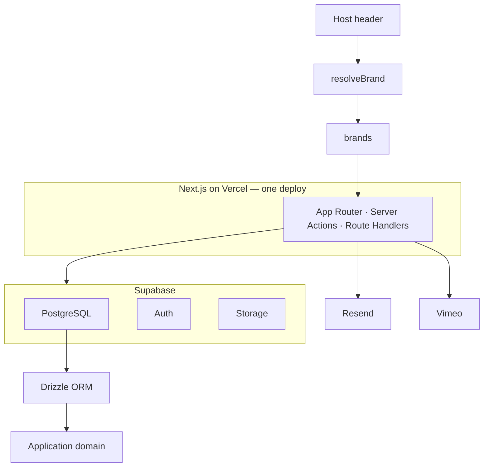
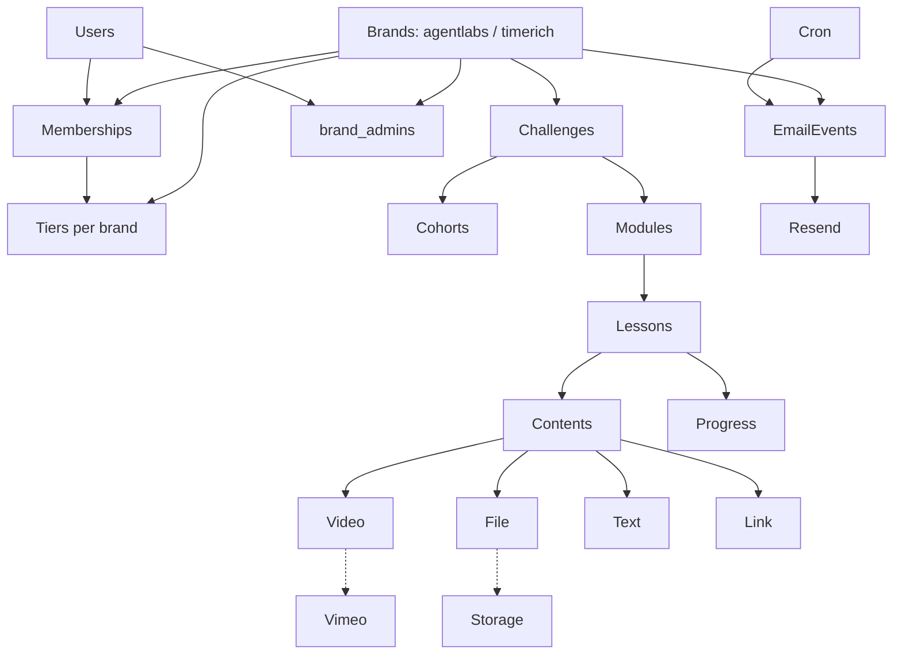
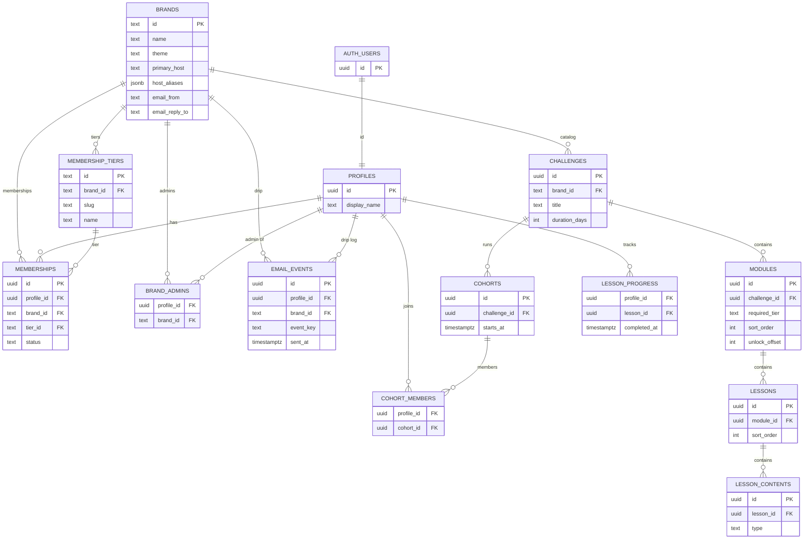

# Architecture

Target stack: **Next.js + Supabase + Drizzle + Resend + Vimeo**, hosted on **Vercel**.

One deploy serves **The Agent Labs** (`agentlabs`) and **Time Rich** (`timerich`). Same layout; brand from **Host**; shared auth; brand-scoped catalog, memberships, and email.

Visual maps (generated from early sketches — mermaid below is the source of truth for multi-brand):

- [System architecture](./diagrams/agent-labs-system-architecture.png)
- [Data model](./diagrams/agent-labs-data-model.png)

What already works once `brand_id` is on the challenge spine: `cohorts` → `modules` → `lessons` → `lesson_contents`, and `lesson_progress` (via lesson → challenge → brand). Do **not** put `brand_id` on every leaf table. Keep `profiles` global (no brand on profile).

## System



| Service                     | Role                                                   | When                   |
| --------------------------- | ------------------------------------------------------ | ---------------------- |
| Next.js (Vercel)            | UI, server actions, cron, authorization, brand resolve | Now                    |
| Supabase Auth               | Login, sessions, `auth.users` (shared across brands)   | Now                    |
| Supabase Postgres + Drizzle | Brands, profiles, brand-scoped catalog & progress      | Now                    |
| Supabase Storage            | Lesson files; keys prefixed `/{brand_id}/...`          | When needed            |
| Resend                      | Drip / unlock email; `from` / templates per brand      | After content skeleton |
| Vimeo                       | Lesson video host                                      | **v1**                 |

Next.js talks to Supabase/Resend/Vimeo. **Drizzle** is the only way application code queries Postgres. Keep business rules (gating, drip, progress, brand scope) out of UI components.

## Brand resolution

- **`resolveBrand(request)`** maps `Host` → `brands` row (`primary_host` or `host_aliases`).
- Local fallback: env `BRAND_HOST_MAP` (JSON) or default `agentlabs` on `localhost`.
- Seed brands: `agentlabs` (theme `agentlabs`), `timerich` (theme `timerich`).
- Pass brand into `(student)` / `(admin)` layouts. **Never trust client-supplied `brand_id` for authz.**
- Root layout sets `data-theme={brand.theme}`.

## Application domain



- A **brand** owns theme, hostnames, and Resend identity.
- A **challenge** belongs to one brand (40-day program definition).
- A **cohort** is a dated run of that challenge. Students join cohorts, not the challenge directly.
- **Modules → lessons → lesson_contents** is the catalog. Content types: `video` (Vimeo, later), `file` (Storage), `text`, `link`.
- **Membership tier** (per brand) decides which catalog the student sees on that host.
- **Progress** is per user per lesson (brand via lesson → challenge).
- **Cron + email_events + Resend** is the drip sequence, scoped by brand so keys do not collide.

Pacing (weekly drip vs 40-day day-index) is an open product decision. Model `unlock_at` / `day_offset` (or `unlock_offset`) on modules or lessons so either schedule can land without a schema rewrite.

## Data model

Supabase Auth stays the identity root. App tables live in `public` and are declared in Drizzle (`src/db/schema/`, one domain per file).



Constraints to enforce in Drizzle:

- `membership_tiers`: unique `(brand_id, slug)`
- `memberships`: one active row per `(profile_id, brand_id)`
- `email_events`: unique `(profile_id, brand_id, event_key)`
- `brand_admins`: PK `(profile_id, brand_id)`

**Read path for a student:** Host → `brands` → `auth.users` → `profiles` → brand-scoped `memberships` → `cohort_members` → `cohorts` → `challenges` (must match brand) → `modules` → `lessons` → `lesson_contents`, filtered by tier and drip window.

**Per-user tables:** `memberships` (per brand), `cohort_members`, `lesson_progress`, `email_events` (per brand), `brand_admins`.

## App map

Same layout for both brands; chrome and copy follow the resolved brand.

```
Next.js
├── Public
│   ├── Login
│   ├── Forgot password
│   └── Onboarding
│
├── Student Portal
│   ├── Dashboard
│   ├── Challenge
│   ├── Lessons
│   ├── Resources
│   └── Account
│
├── Admin Portal
│   ├── Dashboard
│   ├── Users
│   ├── Cohorts
│   ├── Modules
│   ├── Lessons
│   └── Content
│
└── Server
    ├── resolveBrand (Host → brands)
    ├── Server Actions
    ├── Route Handlers
    ├── Authorization
    └── Business Logic
```

Intended App Router layout (route groups do not appear in the URL):

```
app/
├── (public)/
│   ├── login/page.tsx
│   ├── forgot-password/page.tsx
│   └── onboarding/page.tsx
├── (student)/
│   ├── layout.tsx          # student chrome, brand + membership-aware
│   ├── dashboard/page.tsx
│   ├── challenge/page.tsx
│   ├── lessons/[lessonId]/page.tsx
│   ├── resources/page.tsx
│   └── account/page.tsx
├── (admin)/
│   └── admin/
│       ├── layout.tsx      # brand_admins for current host brand
│       ├── page.tsx
│       ├── users/page.tsx
│       ├── cohorts/page.tsx
│       ├── modules/page.tsx
│       ├── lessons/page.tsx
│       └── content/page.tsx
├── api/                    # route handlers (webhooks, cron)
├── layout.tsx              # data-theme from resolved brand
└── page.tsx
```

Server code stays out of `app/` UI files:

```
src/
├── db/
│   ├── client.ts
│   └── schema/             # brands, profiles, memberships, catalog, progress, email
├── domain/                 # gating, drip, progress, brand scope — no React
├── brand/                  # resolveBrand(Host), host map for local
├── auth/                   # session helpers, brand_admins checks
└── email/                  # Resend + email_events (brand from/template)
```

Authorization:

- Student routes: session + membership for **current brand**.
- Admin routes: row in `brand_admins` for **current brand** (optional brand switcher later if one person admins both).
- Gate **catalog** by brand + tier in domain functions, not only in CSS/hidden nav.

## Gating (v1 intent)

A lesson is visible when all of these are true:

1. Request brand matches `challenge.brand_id`.
2. User is in a cohort for that challenge.
3. User has an active membership for that brand whose tier is ≥ the module’s required tier.
4. The drip window for that module/lesson has opened (exact rule TBD).
5. Admin has published the row.

Essentials / Edit / Studio should render **different catalogs**, not the same page with locked cards only. Tease upgrades where a higher tier has extra modules.
